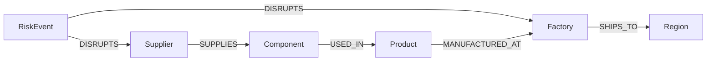
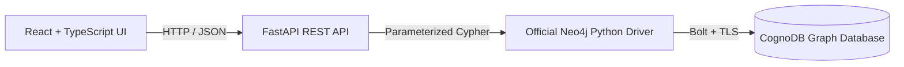
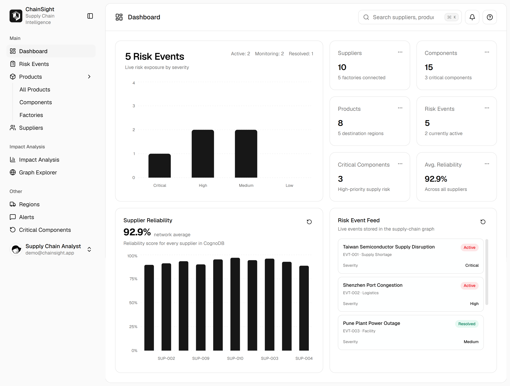
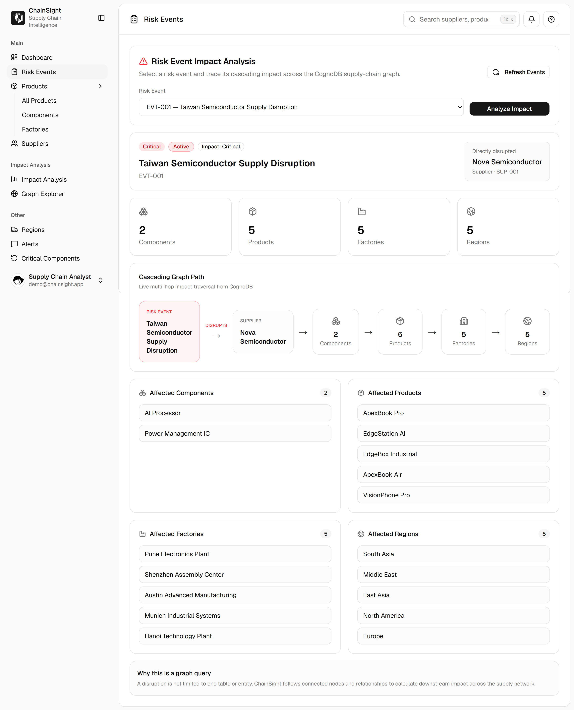
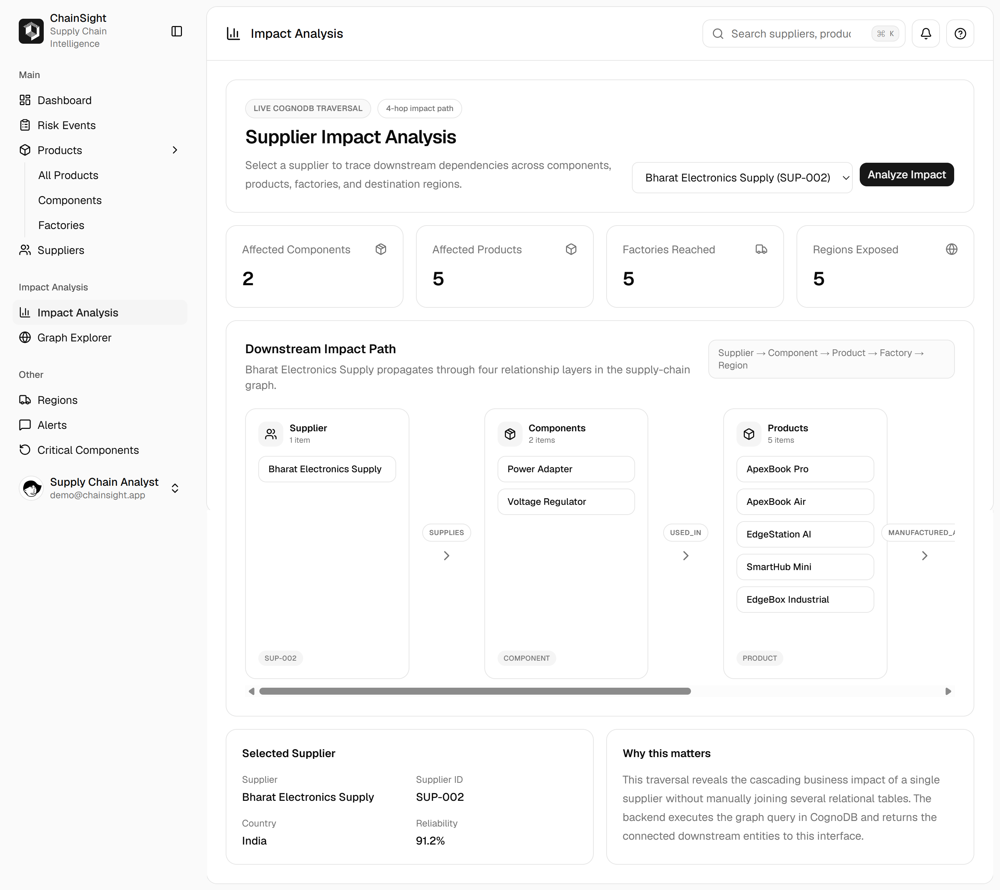
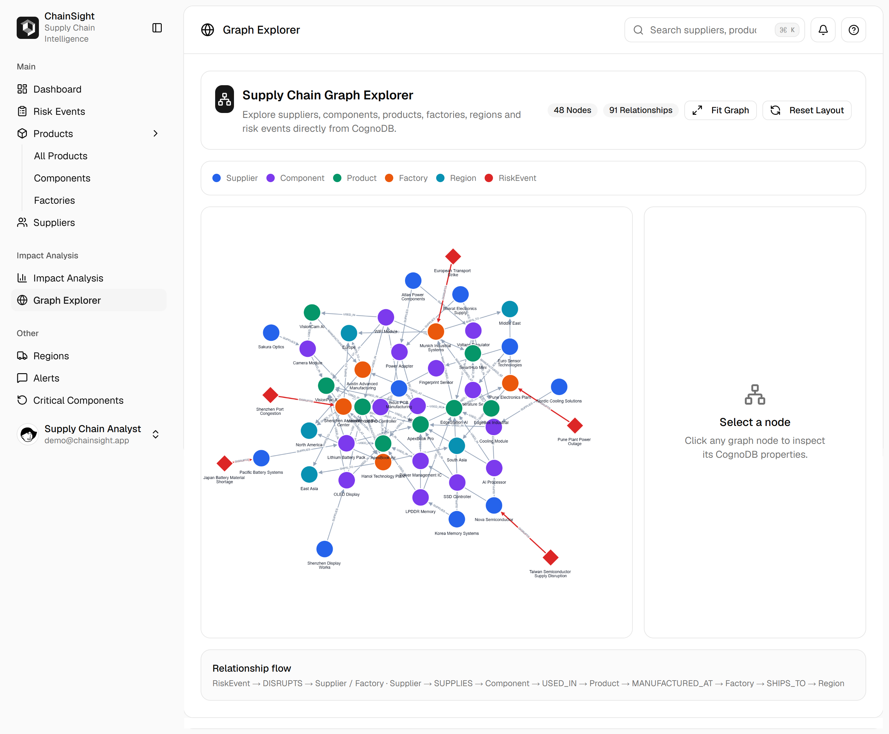

# ChainSight

**Supply Chain Risk & Impact Graph powered by CognoDB**

ChainSight is a graph database-backed supply-chain intelligence application that helps non-technical users explore suppliers, components, products, factories, destination regions, and operational risk events. It demonstrates how disruptions can propagate through a connected supply network and exposes that impact through an interactive dashboard, impact-analysis workflow, and graph explorer.

> Wexa AI — Graph Database Take-Home Assignment

---

## Overview

Traditional supply-chain data is highly connected:

- one supplier can provide multiple components,
- one component can be used in multiple products,
- products can be manufactured at multiple factories,
- factories can ship to multiple regions,
- risk events can directly disrupt a supplier or a factory.

ChainSight models these entities and relationships directly in CognoDB and uses Cypher traversals to answer questions such as:

> If a supplier or factory is disrupted, which components, products, factories, and regions are affected downstream?

The application contains realistic fictional seed data and a React interface intended to be usable by a non-technical operations or supply-chain analyst.

---

## Why a Graph Database?

A supply chain is naturally a network, not a collection of isolated rows.

In a relational database, answering a cascading-impact question can require several join tables and repeated joins across suppliers, components, products, factories, and regions. As the network grows, those queries become harder to understand and maintain.

A graph database represents those connections directly as relationships:

```text
Supplier
   │ SUPPLIES
   ▼
Component
   │ USED_IN
   ▼
Product
   │ MANUFACTURED_AT
   ▼
Factory
   │ SHIPS_TO
   ▼
Region
```

Risk events connect directly to the entity they disrupt:

```text
RiskEvent ──DISRUPTS──> Supplier

or

RiskEvent ──DISRUPTS──> Factory
```

This makes multi-hop dependency and impact analysis a natural graph traversal.

### Example cascading path

```text
RiskEvent
   │ DISRUPTS
   ▼
Supplier
   │ SUPPLIES
   ▼
Component
   │ USED_IN
   ▼
Product
   │ MANUFACTURED_AT
   ▼
Factory
   │ SHIPS_TO
   ▼
Region
```

That is the core reason ChainSight uses CognoDB.

---

## Graph Data Model

### Node labels

| Node | Important properties |
|---|---|
| `Supplier` | `supplier_id`, `name`, `country`, `tier`, `reliability_score` |
| `Component` | `component_id`, `name`, `category`, `criticality`, `unit_cost`, `lead_time_days` |
| `Product` | `product_id`, `name`, `category`, `launch_status` |
| `Factory` | `factory_id`, `name`, `country`, `capacity_per_month` |
| `Region` | `region_id`, `name`, `market_priority` |
| `RiskEvent` | `event_id`, `name`, `event_type`, `severity`, `status` |

### Relationship types

| Relationship | Meaning | Example properties |
|---|---|---|
| `SUPPLIES` | Supplier provides a component | `contract_type`, `min_order_qty` |
| `USED_IN` | Component is used in a product | `units_required` |
| `MANUFACTURED_AT` | Product is manufactured at a factory | `monthly_output` |
| `SHIPS_TO` | Factory ships to a market region | `shipping_days` |
| `DISRUPTS` | Risk event directly disrupts a supplier or factory | `impact_level` |

### Mermaid diagram



A more detailed model description is available in [`docs/data_model.md`](docs/data_model.md).

---

## Seed Dataset

The seed script creates a small but realistic fictional supply network.

| Entity | Count |
|---|---:|
| Suppliers | 10 |
| Components | 15 |
| Products | 8 |
| Factories | 5 |
| Regions | 5 |
| Risk Events | 5 |
| **Total nodes** | **48** |
| **Total relationships** | **91** |

Examples include:

- Nova Semiconductor
- Bharat Electronics Supply
- AI Processor
- Lithium Battery Pack
- ApexBook Pro
- VisionPhone Pro
- Pune Electronics Plant
- Shenzhen Assembly Center
- North America
- Taiwan Semiconductor Supply Disruption

---

## Key Features

### Dashboard

- live CognoDB summary metrics,
- risk-event severity overview,
- supplier reliability visualization,
- live risk-event feed,
- loading, empty, and error states.

### Risk Event Impact Analysis

Select a risk event and trace its cascading impact.

Supports both:

```text
RiskEvent → Supplier
```

and:

```text
RiskEvent → Factory
```

The UI shows:

- severity,
- status,
- impact level,
- directly disrupted entity,
- affected components,
- affected products,
- affected factories,
- affected regions.

### Supplier Impact Analysis

Select a supplier and traverse:

```text
Supplier → Component → Product → Factory → Region
```

The application displays both summary counts and the downstream entities reached by the traversal.

### Interactive Graph Explorer

The full graph can be explored interactively using Cytoscape.js.

Features include:

- 48 graph nodes,
- 91 relationships,
- node-type legend,
- zoom and pan,
- draggable nodes,
- reset/fit controls,
- node property inspection,
- relationship labels,
- highlighted `DISRUPTS` edges.

### Entity Pages

Dedicated live pages are included for:

- Products
- Components
- Factories
- Suppliers
- Regions
- Critical Components
- Alerts

---

## Example Graph Queries

### 1. Two-hop supplier-to-product traversal

This query finds products affected by a supplier through the components it supplies.

```cypher
MATCH (s:Supplier {supplier_id: $supplier_id})
      -[:SUPPLIES]->(c:Component)
      -[:USED_IN]->(p:Product)
RETURN DISTINCT
    s.name AS supplier,
    c.name AS component,
    p.name AS product
ORDER BY p.name, c.name
```

This is parameterized with `$supplier_id`.

---

### 2. Multi-hop downstream supplier impact

```cypher
MATCH (s:Supplier {supplier_id: $supplier_id})
      -[:SUPPLIES]->(c:Component)
      -[:USED_IN]->(p:Product)
      -[:MANUFACTURED_AT]->(f:Factory)
      -[:SHIPS_TO]->(r:Region)
RETURN
    s.supplier_id AS supplier_id,
    s.name AS supplier_name,
    collect(DISTINCT c.name) AS components,
    collect(DISTINCT p.name) AS products,
    collect(DISTINCT f.name) AS factories,
    collect(DISTINCT r.name) AS regions
```

This query answers a business question that would otherwise require several relational joins.

---

### 3. Risk-event cascading impact

The application first identifies the entity directly disrupted by the event:

```cypher
MATCH (e:RiskEvent {event_id: $event_id})
      -[d:DISRUPTS]->(target)
RETURN
    e.event_id AS event_id,
    e.name AS event_name,
    d.impact_level AS impact_level,
    labels(target)[0] AS disrupted_entity_type,
    coalesce(
        target.supplier_id,
        target.factory_id
    ) AS disrupted_entity_id,
    target.name AS disrupted_entity_name
```

ChainSight then traverses the relevant downstream graph depending on whether the disrupted entity is a `Supplier` or `Factory`.

All user-supplied identifiers are passed as query parameters rather than being concatenated into Cypher strings.

---

## Architecture



### Technology Stack

**Frontend**

- React
- TypeScript
- Vite
- Tailwind CSS
- shadcn/ui
- Recharts
- Cytoscape.js

**Backend**

- Python 3.12
- FastAPI
- Neo4j Python Driver
- Pydantic Settings
- python-dotenv

**Database**

- CognoDB
- openCypher
- Bolt connection

---

## Project Structure

```text
ChainSight_CognoDB/
│
├── backend/
│   ├── app/
│   │   ├── api/
│   │   │   └── routes.py
│   │   ├── core/
│   │   │   └── config.py
│   │   ├── db/
│   │   │   └── connection.py
│   │   ├── schemas/
│   │   │   └── graph.py
│   │   ├── services/
│   │   │   └── graph_service.py
│   │   └── main.py
│   │
│   ├── data/
│   │   ├── seed_data.py
│   │   └── relationships.py
│   │
│   ├── scripts/
│   │   ├── seed.py
│   │   ├── test_connection.py
│   │   └── test_queries.py
│   │
│   ├── .env.example
│   └── requirements.txt
│
├── frontend/
│   ├── src/
│   │   ├── components/
│   │   ├── hooks/
│   │   ├── lib/
│   │   │   └── api.ts
│   │   ├── App.tsx
│   │   └── main.tsx
│   ├── package.json
│   └── vite.config.ts
│
├── docs/
│   └── data_model.md
│
├── .gitignore
└── README.md
```

---

## CognoDB Setup

### 1. Create a CognoDB instance

Create a CognoDB account and provision a free `c0` instance.

Save the generated:

- Bolt + TLS URI
- username
- password

The application uses the CognoDB username:

```text
cognodb
```

### 2. Configure backend environment variables

Move into the backend directory:

```powershell
cd backend
```

Copy the example environment file:

```powershell
Copy-Item .env.example .env
```

Edit `backend/.env`:

```env
COGNODB_URI=bolt+s://your-instance-id.databases.cognodb.cloud
COGNODB_USER=cognodb
COGNODB_PASSWORD=your-password
```

Do not commit this file.

---

## Backend Setup

From the project root:

```powershell
cd backend
```

Create a Python 3.12 virtual environment:

```powershell
py -3.12 -m venv .venv
```

Activate it:

```powershell
.\.venv\Scripts\Activate.ps1
```

Install dependencies:

```powershell
pip install -r requirements.txt
```

### Test CognoDB connection

```powershell
python -m scripts.test_connection
```

Expected result:

```text
CognoDB connection successful!
ChainSight connected to CognoDB
```

### Seed the graph

```powershell
python -m scripts.seed
```

The seed script is safe to rerun because graph entities are created with `MERGE`.

### Test core graph queries

```powershell
python -m scripts.test_queries
```

### Start the API

```powershell
python -m uvicorn app.main:app --reload
```

Backend:

```text
http://127.0.0.1:8000
```

Swagger UI:

```text
http://127.0.0.1:8000/docs
```

---

## Frontend Setup

Open another terminal:

```powershell
cd frontend
```

Install dependencies:

```powershell
npm install
```

Create:

```text
frontend/.env.local
```

Add:

```env
VITE_API_BASE_URL=http://127.0.0.1:8000
```

Start the frontend:

```powershell
npm run dev
```

Frontend:

```text
http://localhost:5173
```

### Production build

```powershell
npm run build
```

---

## API Endpoints

| Method | Endpoint | Purpose |
|---|---|---|
| GET | `/api/health` | CognoDB connectivity health check |
| GET | `/api/dashboard/summary` | Dashboard graph statistics |
| GET | `/api/graph` | Full graph for Graph Explorer |
| GET | `/api/suppliers` | Supplier list |
| GET | `/api/suppliers/{supplier_id}/components` | Components supplied by a supplier |
| GET | `/api/suppliers/{supplier_id}/products` | Two-hop affected products |
| GET | `/api/suppliers/{supplier_id}/impact` | Full downstream supplier impact |
| GET | `/api/risk-events` | Risk-event list |
| GET | `/api/risk-events/{event_id}/impact` | Cascading event impact |

---

## Example API Results

### Dashboard summary

```json
{
  "total_suppliers": 10,
  "total_components": 15,
  "total_products": 8,
  "total_factories": 5,
  "total_regions": 5,
  "total_risk_events": 5,
  "active_risk_events": 2,
  "critical_components": 3,
  "average_supplier_reliability": 92.9
}
```

### Supplier impact

```text
Nova Semiconductor
    ↓
2 Components
    ↓
5 Products
    ↓
5 Factories
    ↓
5 Regions
```

### Factory disruption example

`EVT-002 — Shenzhen Port Congestion`

```text
Risk Event
   ↓ DISRUPTS
Shenzhen Assembly Center
   ↓
13 affected components
3 affected products
1 affected factory
3 affected regions
```

---

## Error Handling

The backend handles CognoDB connectivity and Neo4j driver failures gracefully and returns a `503 Service Unavailable` response instead of crashing the application.

The frontend includes:

- loading states,
- empty states,
- API error messages,
- retry/refresh controls.

---

## Security

Secrets are loaded from environment variables.

Files such as these are intentionally ignored by Git:

```text
backend/.env
backend/.venv
frontend/.env.local
frontend/node_modules
frontend/dist
```

Only placeholder values are stored in `.env.example`.

---

## Screenshots

### Dashboard

Live supply-chain overview with suppliers, components, products, risk events,
critical components, supplier reliability, and risk severity analytics.



### Risk Event Impact Analysis

Cascading disruption analysis from a RiskEvent through the connected supply-chain graph.



### Supplier Impact Analysis

Multi-hop traversal:

`Supplier → Component → Product → Factory → Region`



### Interactive Graph Explorer

Interactive visualization of the complete CognoDB graph with **48 nodes and 91 relationships**.



---

## Hosted Demo

**Live application:** https://chainsight-cognodb-wexa.vercel.app

**API:** https://chainsight-api-k5sf.onrender.com

---

## Screen Recording

**Demo video:** `ADD_SCREEN_RECORDING_URL_HERE`

Suggested demo flow:

1. Open the dashboard.
2. Show live graph metrics.
3. Open Risk Events.
4. Analyze `EVT-001`.
5. Analyze `EVT-002` to demonstrate factory disruption.
6. Open Supplier Impact Analysis.
7. Open Graph Explorer and click a node.
8. Show Products, Components, Factories, Suppliers, Regions, and Critical Components.
9. Briefly explain why the graph model is useful.

---

## Current Graph Verification

The seeded graph currently contains:

```text
48 nodes
91 relationships
```

Example relationship:

```text
Nova Semiconductor
    └── SUPPLIES
          └── AI Processor
```

---

## Design Decisions

### Why separate service and API layers?

Cypher queries live in `GraphService`, while HTTP concerns remain in the FastAPI route layer. This keeps graph-query logic reusable and easier to test.

### Why parameterized Cypher?

Identifiers such as supplier IDs and event IDs are sent using parameters like:

```cypher
$supplier_id
```

and:

```cypher
$event_id
```

instead of being concatenated into the query string.

### Why one graph endpoint for visualization?

`GET /api/graph` exposes a normalized representation:

```json
{
  "nodes": [],
  "edges": [],
  "node_count": 48,
  "edge_count": 91
}
```

This allows the frontend Graph Explorer to remain independent of Neo4j-specific driver objects.

---

## Future Improvements

With additional time, ChainSight could be extended with:

- authentication and role-based access,
- risk-event creation and editing,
- supplier onboarding workflows,
- historical risk trends,
- graph-based shortest dependency paths,
- alternative supplier recommendations,
- inventory and stock-level nodes,
- real-time logistics data,
- automated alert notifications,
- larger graph datasets and pagination.

---

## Assignment Deliverables Checklist

- [x] CognoDB-backed graph application
- [x] Thoughtful labeled graph model
- [x] Typed relationships with properties
- [x] Realistic seed data
- [x] Seed/loading script
- [x] Parameterized Cypher queries
- [x] Two-hop query
- [x] Multi-hop cascading impact query
- [x] Functional web application
- [x] Loading / empty / error states
- [x] Graceful database error handling
- [x] Interactive Graph Explorer
- [x] Environment-based secrets
- [x] README setup instructions
- [x] Graph model diagram
- [x] Final screenshots
- [x] Hosted frontend
- [x] Hosted backend
- [ ] Screen recording

---

## Author

**Siddharth Belgahe**

Built for the Wexa AI Graph Database Take-Home Assignment.
