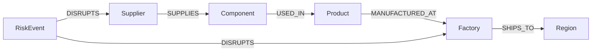

# ChainSight Data Model

## 1. Use Case

ChainSight is a supply-chain risk and impact exploration application powered by CognoDB.

The application helps users analyze how disruptions at suppliers or factories can cascade through components, products, manufacturing facilities, and destination regions.

### Primary Business Question

If a supplier is disrupted, which components, products, factories, and regions are affected?

---

## 2. Why a Graph Database?

Supply chains are naturally relationship-heavy.

A graph database is useful because:

- Multi-hop impact analysis is easy to express.
- Relationships are first-class parts of the data model.
- Cascading supplier impact can be explored naturally.
- New entities and relationships can be added easily.
- Complex relationship queries require many joins in a relational database.

---

## 3. Node Types

| Label | Purpose | Key Properties |
|---|---|---|
| Supplier | Companies providing components | supplier_id, name, country, tier, reliability_score |
| Component | Parts used in products | component_id, name, category, criticality, unit_cost, lead_time_days |
| Product | Finished products | product_id, name, category, launch_status |
| Factory | Manufacturing facilities | factory_id, name, country, capacity_per_month |
| Region | Destination markets | region_id, name, market_priority |
| RiskEvent | Supply-chain disruption | event_id, name, event_type, severity, status |

---

## 4. Relationship Types

| From | Relationship | To | Properties |
|---|---|---|---|
| Supplier | SUPPLIES | Component | contract_type, min_order_qty |
| Component | USED_IN | Product | units_required |
| Product | MANUFACTURED_AT | Factory | monthly_output |
| Factory | SHIPS_TO | Region | shipping_days |
| RiskEvent | DISRUPTS | Supplier | impact_level |
| RiskEvent | DISRUPTS | Factory | impact_level |

---

## 5. Graph Diagram

---

## 6. Key Query Scenarios

1. Find components supplied by a supplier.
2. Find products affected by a supplier disruption.
3. Find factories affected by a supplier disruption.
4. Find destination regions affected by a disruption.
5. Find high-criticality components.
6. Analyze the downstream impact of a risk event.

---

## 7. Multi-hop Traversals

### Supplier Impact

Supplier → Component → Product

### Extended Impact

Supplier → Component → Product → Factory → Region

### Risk Event Impact

RiskEvent → Supplier → Component → Product → Factory → Region

---

## 8. Relationally Awkward Query

Given a risk event, determine the complete downstream impact from a disrupted supplier through components, products, factories, and destination regions.

A relational implementation would require several joins across multiple tables. In a graph database, this relationship path can be expressed directly as a traversal.